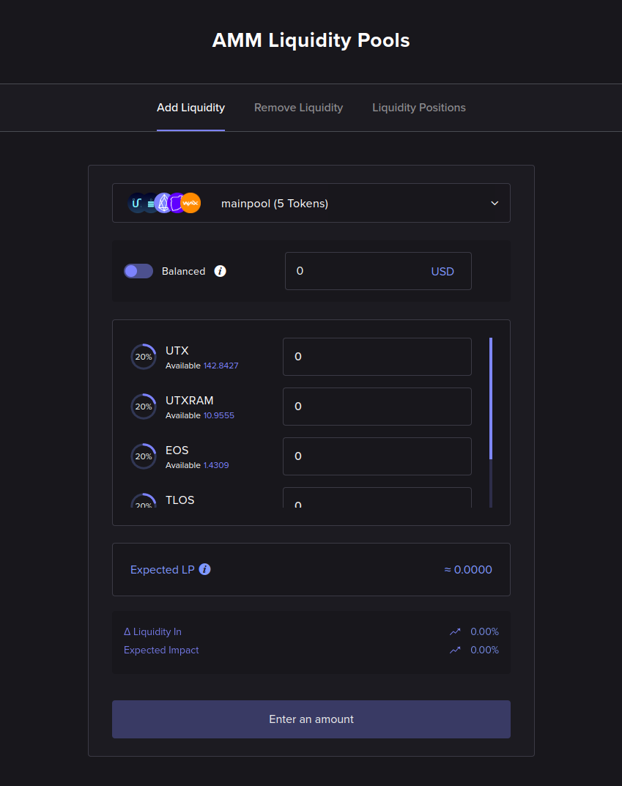
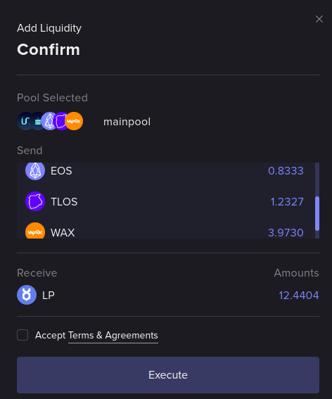

# Add Liquidity

This section shows how to provide liquidity to UtilityX.

## Open the Add Liquidity page

On the main menu bar at the top left of the page, hover your mouse over the **Trade** drop-down menu to expand it.

Then, click on the **AMM Liquidity** option:

This should automatically open the **Add Liquidity** tab in the AMM Liquidity page:

## Select pool

At the top of the Add Liquidity form, you will select the AMM pool that you wish to add liquidity to.

Each pool supports a different set of tokens. You need to have a non-zero quantity of at least one of the tokens in a pool to be able to add liquidity to it.

## Balanced vs. unbalanced

After selecting a pool, you will need to decide whether to add _balanced_ or _unbalanced_ liquidity.

By default, the Add Liquidity form will operate in balanced mode:

In balanced mode, you need to have a sufficient quantity of _all_ the tokens that the pool supports, and you will be depositing to the pool an equivalent amount of trade value for each token. To do that, you will simply choose an amount of trade value (in this case, in `USD`) to deposit into the pool, as shown in the figure above, and UtilityX will calculate for you every token amount that you will need.

If you click on the toggle button to the left of _balanced_, you will switch to unbalanced mode:

In unbalanced mode, you can freely choose the amount of each token that you will be depositing into the pool. This is the most convenient way to provide liquidity (for example, you can choose an amount for only a single token to deposit), but it will incur extra fees.

## Add liquidity (balanced)

In the example below, we are adding `5 USD` of balanced liquidity to an AMM pool called `mainpool` that has 5 tokens:

In the figure above, each one of the automatically-computed five token quantities in this sample pool is worth 20% of 5 USD, or exactly 1 USD, considering some sample, arbitrary token prices (the `WAX` sample token does not fit in the screenshot, unfortunately, but you would be able to use the scroll bar inside the token list in the form to see it).

Clicking **Continue** will show a confirmation dialog:

Clicking **Execute** will prompt you to sign a transaction on your Web3 wallet. Once you do so, the following progress indicator on the bottom right will show up:

Once the operation is complete, an information box will appear in the bottom right:

You can click it to view the report (or search for the report on the order history menu on the top right):

In the above _balanced liquidity add_ example, we traded approximately `5 USD` worth of five different tokens (in the `mainpool` of the example, those were `UTX`, `UTXRAM`, `EOS`, `TLOS` and `WAX` tokens) for `12.4091 LP`, which are tokenized shares on the `mainpool` AMM pool. This amount is less than the `12.4404 LP` that was estimated (see **Expected LP** in the example Add Liquidity form above) since that estimate does not include fees.

## Add liquidity (unbalanced)

Adding unbalanced liquidity will require you to choose an exact quantity of each token that you wish to deposit into the pool, in exchange for shares of the pool.

In the example below, the user is simply depositing `30 UTX` into the pool, and letting UtilityX do the work of rebalancing the token pool:

Adding unbalanced liquidity is, otherwise, identical to adding balanced liquidity. Please refer to the previous section (adding balanced liquidity) if you need help with the next steps.
