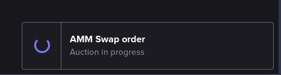

# Swap

We will now perform our first trade, which will be a simple swap between a quantity of a token that we have, and some equivalent quantity of a token that we want to have in exchange for it.

## Open the Swap page

On the main menu bar at the top left of the page, hover your mouse over the **Trade** drop-down menu to expand it.

Then, click on the **AMM Swap** option:

This should open the AMM Swap page, which will allow us to perform our trade:

> **_NOTE:_** In the above screen image, a warning message that reads _No bridged EOS available_ can be read on the bottom right of the page. Bridged EOS in this case means a quantity of native `EOS` tokens that have been transported from the EOS blockchain to the UX Network. A token is said to be _bridged_ or _wrapped_ when it represents a native token from another blockchain. In this case, this means a quantity of `EOS` tokens on the UX Network which would be therefore the _bridged_ (wrapped) version of some quantity of native `EOS` tokens that have been locked in the EOS network and transported to your account in the UX Network through inter-blockchain token bridging, becoming bridged `EOS` that can then be traded normally on the UX Network like you would do with any other native token of the UX Network, such as the `UTX` and `UTXRAM` tokens.

## Select liquidity pool

All AMM operations on UtilityX are performed against a _liquidity pool_, or just _pool_ for short. AMM pools are essentially containers of arbitrary quantitites of tokens, provided by _liquidity providers_. The default pool offered by the AMM Swap page by default should be good enough for this first swap, but you can explore the available pools and select the pool to use on your own by clicking the pool selection box (in the example screen image above, it is the one that reads `mainpool (5 Tokens)`, but your default selected pool may be different.

After you have settled for a liqudity pool to use, it is time to select the tokens. 

## Select tokens

You now have to select the token you want to _send_ to the pool (sell) and the token you want to _receive_ from the pool in return (buy).

In this example we will assume you have some quantity of liquid `UTX` tokens in your account that are available for a trade, but you can use any token supported by the liquidity pool you have selected.

In the **Send** section, click on the drop-down box at the right to select the `UTX` token.

Then, in the **Receive** section, click on the drop-down box at the right to select the `UTXRAM` token.

Your AMM Swap page should now look like this:

We have now determined that we want to send some quantity of `UTX` tokens, and receive a quantity of `UTXRAM` tokens in return. Now we have to determine the token amounts.

## Select amount to send

To the right of the **Send** area, you can see the amount of the selected token that you have available to send. In the figure above, we can see that we have exactly one hundred (100) `UTX` tokens available to send from our logged-in blockchain account.

Now, in the **Send** area, enter any available amount that you are willing to trade in. In our example, we will be selling one (1) UTX token to the AMM pool.

After you finish entering your amount, click on the amount edit box on the **Receive** area, and the platform should automatically compute an estimate on the expected amount of tokens to be received in return from the pool:

At this point, the button at the bottom of the form will be clickable, and change its text to **Submit**, signaling that the form is complete and that we are ready to execute the token swap on the blockchain.

Before we move on to finish the swap, click on the small white downwards-pointing arrow just above the **Submit** button. This will allow you check more information pertaining to your swap quote:

## Execute swap

When you are ready to perform the swap, click on the **Submit** button at the bottom of the AMM Swap form.

A confirmation pop-up window will appear:

You must check the **Accept Terms & Agreements** checkbox; click on the link to read the Terms & Agreements.

After you have accepted the terms, click on **Execute**. This will create a blockchain transaction that will have to be signed by your Web3 wallet. The process for approving and signing the transaction will depend on the blockchain and wallet software that you are using. Usually, this means your wallet will pop-up a window on your computer with information regarding the transaction to be signed, and a button that you must click to approve the transaction. 

Once you have approved and signed the transaction with your Web3 wallet, the **Execute** button should show a spinning progress indicator for a while, until your swap order is successfully queued for execution by the blockchain.

## Await swap completion

When the swap is in progress, the following information box should pop up on the bottom-right of the screen:

Once the swap is completed, you should see the following information box pop up:

That will mean the swap is done, and we can now inspect the swap report.

## Check swap report

All UtilityX trades generate reports. To open the available reports on an order, first click on the order history menu icon at the top right of the screen:

Your most recent trades should then be listed, and it should look something like this:

In the above trade history entry, we can see our request to swap `UTX` for `UTXRAM` tokens. The blue icon in the **Report** column is a link, and by clicking on it you can access the detailed report for the executed order:

The transaction report above shows that we have successfully sent `1 UTX` to the selected pool (`mainpool`), and that we have received `0.232 UTXRAM` in return.

Congratulations, you have executed your first UtilityX AMM Swap!
