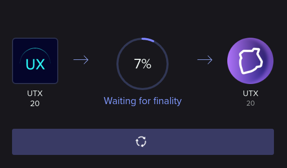

# Bridge

This section shows how to use the UtilityX Bridge.

## What is token bridging?

Before we begin using the UtilityX Bridge, let's delve a bit into what it is, what it does, and how it works.

The UtilityX Bridge allows you to transfer tokens from one of your accounts on one blockchain, to another account on another blockchain, in a decentralized and secure manner. This inter-blockchain transfer of tokens is called _bridging_.

Basically, token bridging begins by _locking_ a quantity of tokens on the token's source chain (that is, the blockchain that the token is _native_ to), and then issuing an equivalent quantity of a _bridged_ (also referred to as _wrapped_) version of the token on the destination chain.

For example, the `UTX` token is native to the UX Network blockchain, but through the UtilityX Bridge, it can be transferred to the EOS blockchain. So, for example, if you have `10 UTX` tokens available on an account `myutxaccount` in the UX Network, you can send them to the bridge, where they are locked. Then, on the chosen destination chain, such as the EOS blockchain, you also choose a destination account there, such as `myeosaccount`. The bridge will then issue `10 UTX` on the EOS network, and deposit those tokens on that EOS account.

In this example, it is important to note that the bridged `UTX` tokens on an EOS blockchain account are really tokens that are on the EOS blockchain. So, for example, you can't take `UTX` tokens on an EOS account and stake them for your UX Network account. Nevertheless, these `UTX` tokens on the EOS network are equivalent to the native `UTX` tokens that were locked (taken out of circulation) on the UX Network side of the bridge.

The bridge also allows you to return bridged tokens to their source blockchain. For example, you can send bridged `UTX` tokens from your EOS blockchain account to your UX Network account. In that case, the bridge will retire (burn, destroy) the bridged `UTX` on EOS, and unlock the corresponding amount of native `UTX` tokens on the UX Network.

The blockchain technology underlying the UtilityX Bridge is called Antelope Inter-Blockchain Communication (IBC). You can read the in-depth technical documentation of Antelope IBC [here](https://ibc-docs.uxnetwork.io/).

## Before you bridge

To use the UtilityX Bridge, you need to go through the following checklist first:

* Choose a **source blockchain**, that is, the blockchain that will be sending tokens;

* Choose a **source account**, that is, the account on the source blockchain that will be sending the tokens. You must control (i.e. have the private key) this account, and it must be configured in your Web3 wallet;

* Choose a **destination blockchain**, that is, the blockchain that will be receiving the tokens;

* Choose a **destination account**, that is, the account on the destination blockchain that will be receiving the tokens. Like the source account, you must also control this account and have it loaded in your Web3 wallet;

* Choose a **token** to send. You must have this token on your source account, and the chosen token must be supported by the UtilityX Bridge;

* Choose a **quantity** of the token to send. You must have this quantity liquid and available on your source account;

* Make sure both your source account and destination account have **sufficient resources** (CPU, NET, and RAM, in the case of Antelope blockchains) to complete the bridging operation. If your blockchain supports the PowerUp resource model (e.g. the EOS mainnet) then you may need to power up your account. You should also have sufficient free RAM available on your accounts.

If either your source or destination account turns out to not have sufficient resources, you don't have to worry, as you will be able to securely retry the bridging operation with more account resources. There is no way to lose tokens in the process.

After satisfying the checklist, we are ready to execute our first token bridging operation.

## Open the Bridge page

On the menu at the top left, find the **Bridge** option and click it:

This will open the Bridge page, where you can enter all the information you have already prepared for your planned token bridging operation:

## Log in to bridge endpoint

First, you must choose the source and destination blockchains. The first blockchain selected (at the top) is the source blockchain, where the tokens are coming from, and the second blockchain selected (at the bottom) is the destination blockchain, which will receive the tokens.

After selecting both the source and destination blockchains, you have to log in to an account on both blockchains, using your Web3 wallet. The drop-down buttons to the right of each blockchain name can be clicked to initiate the log in procedure for an account in that blockchain, or to log out of the account that is already logged in for that blockchain. You can freely choose any account to use at both endpoints. 

In the example bridging operation, we are going to be transferring some `UTX` tokens from our `testutilityx` account on the UX Network, to an account named `testuxbridge` on the Telos network:

## Select token and amount

Now you have to select the token to be sent, and the amount to send. These are selected on the source blockchain area of the form. If you click the name of the token, a pop-up window will appear, which will allow you to select from a list of tokens supported by the UtilityX Bridge for the selected blockchains. The token amount can be directly entered in the numeric edit box to the immediate left of the selected token's symbol.

In our example, we will be sending `20 UTX` tokens, which is adequate, given that our available balance to send in this example seems to be `95 UTX`:

After making sure that we have enough resources staked on both blockchain accounts, we are ready to execute the token bridging operation.

## Start token transfer process

After you click on the **Transfer** button, a confirmation message will appear, which allows you to review your request:

To execute the transfer, accept the Terms & Agreements and click **Execute**. This should cause your Web3 wallet to prompt you to sign a transaction for your source chain account. Approve the transaction on your Web3 wallet.

## Wait for source finality

After you have approved and signed a bridging transaction for the source chain, you should see the following progress indicator:

What we are doing here is waiting for the transaction sent to the source chain to be final, that is, irreversible on the blockchain. We need it to be final before we can move on to the next step, which will be to submit a transaction to the destination chain that proves that we have transferred the tokens on the source chain.

## Submit proof to destination

When finality is achieved on the source chain, the UtilityX interface will display the following information box on the bottom right:

Soon after, your Web3 wallet should ask you to approve another transaction, but this time it is a transaction for the destination chain. Approve that second transaction on your Web3 wallet as well.

Once the second transaction is approved, you should see another progress indicator:

Once this final operation is completed, your bridge operation should be complete. The report for the bridge transfer will then be automatically displayed on the screen:

Congratulations! You have securely and quickly transferred, in a completely decentralized way, tokens between two blockchains!

## Check bridge history

If you click the **Previous Transactions** tab under the Bridge page, you can inspect your past bridging transaction requests:

We can see the example bridging operation we just carried out in the above picture. Its status is **Complete**, since it completed successfully.

## Completing interrupted transfers

In the example below, we have attempted another transfer of `10 UTX` from the UX Network to the Telos network, but we have closed our web browser window a few seconds after we requested the transfer. We exited the UtilityX platform while waiting for finalization on the source chain, which has prevented us from being able to sign the final transaction on the destination chain that would complete the bridging process. This causes the bridging operation to be in an incomplete state, and once we open UtilityX again, the operation will show up on the Previous Transactions tab with a status of **Failed**, like this:

If a bridging transfer has failed for whatever reason, you will be able to find it in the Previous Transactions tab with a Failed status, as shown in the above example. To resume the failed bridging operation, just click the **Retry** button. The retry process is identical to the normal process; it will just pick up where it left off.

> **IMPORTANT:** For UtilityX to be able to find your bridging transaction history, you must be logged in to both accounts, on both endpoints of the transfer, specifically using the Bridge form to do so. UtilityX Bridge cannot find your bridging transaction history if you are just logged in on the main website, using the log in link at the top right of the page. To find the specific bridging transaction history that you are looking for, you have to go to the Bridge page, select both blockchains (in the correct source and destination order) and log in to both accounts so that the Previous Transactions tab can show your bridging history for those two blockchains and those two accounts, specifically.

