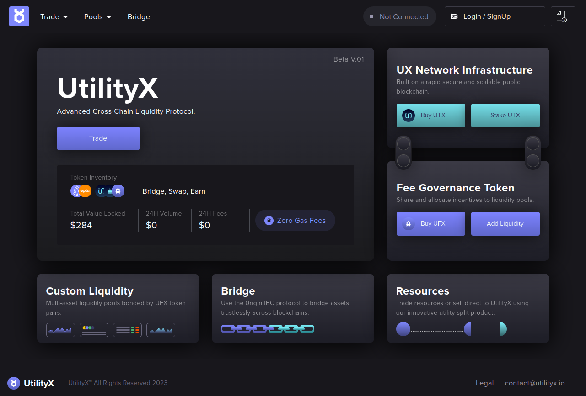

# Introduction

This is the [UtilityX](https://utilityx.io) User Guide.

This guide will show you how to to use all of UtilityX's features.

> **_NOTE:_** This guide is written in a walkthrough format, but you can skip to any section that interests you by using the navigation bar on the left.

To get started, [open the UtilityX platform](https://utilityx.io) on your browser. You should be greeted by the UtilityX logo:

Click **Enter** to open the main UtilityX screen:

