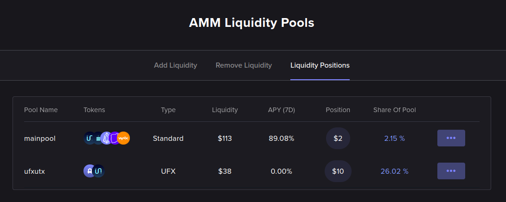

# Liquidity

This section explains what Liquidity Providers are and how liquidity works in the UtilityX platform.

## What is a Liquidity Provider?

FIXME LP is when tokens thrown into the pool and you obtain a token that represents a share of the pool then the pool does swap for other people and the pool retains some of the tokens and so your LP share is worth more and more tokens and the interface knows how to compute an estimate APY and dollar value of your shares out of that and show it to you on the liquidity positions tab.

## Why provide liquidity on UtilityX?

FIXME Being an LP in UtilityX is awesome because: bullet points list, advanced options, easy to use, antelope no fee, antelope fast, batch auction, etc.

## The LP token(s)

FIXME Explain what the various LP tokens are, they are shares of pools, and you can actually transfer them around and negotiate them, why wouldn't you be able to do that?

## The UFX token

FIXME Explain what UFX is: it's a nice token to have because fees when certain pools

## The types of pools

FIXME You provide liquidity to a specific pool that you have to choose. Explain the different types of pools you can choose to stake (be an LP) to (multipool > 2 assets, pair pools vs. UFX); that they give out different LP tokens and the relationship to the UFX token.

## Example

The figure below shows an example list of user liquidity positions, which helps to illustrate:

(The page above can be accessed under the **Trade** menu, option **AMM Liquidity**, under the **Liquidity Positions** tab. But before you actually start providing liquidity, your Liquidity Positions tab will be empty, of course.)

The table lists all the pools that the user has a liquidity position in, together with the type of pool, the total amount of liquidity in the pool, an instant estimate of the APY (Annual Percentage Yield) being earned by the positions, the user's provided amount of liquidity, and the percent share of the pool that the user's position represents.

