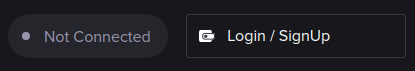
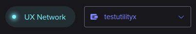

# Logging in

UtilityX is a fully-decentralized Web3 platform. To use UtilityX, you must have:

* A supported Web3 wallet installed (for example, [Anchor](https://www.greymass.com/anchor));

* A blockchain account on a supported blockchain network (for example, an account in the UX Network);

* Your blockchain account's private key already stored on your Web3 wallet.

If you have met all these prerequisites, you can click on the **Login / SignUp** button on the top right:

A pop-up window should appear, which will allow you to select the blockchain network to use (for example, the UX Network) and your Web3 wallet (for example, Anchor). You must have an account in the selected blockchain, and the Web3 wallet you select must already have that account loaded in it. 

When you click on the button that will connect you to your Web3 wallet of choice, the UtilityX website on your browser will initiate a procedure to connect to your specific Web3 wallet. This procedure will depend on the Web3 wallet you have chosen.

As an example, the connection procedure for Anchor may open a pop-up with a QR Code image in it, and an _Open Anchor app_ link below the QR code, which you can click to connect if you are using the Desktop version of Anchor.

When you are successfully logged in, you should see, in the top right corner, the name of the blockchain you are logged in with, followed by the name of your account in that blockchain that you are logged in with:

> **_NOTE:_** All the example screen images in this guide will picture an account named `testutilityx` on the UX Network. Naturally, you will be using your own blockchain account, which will display a different name.
