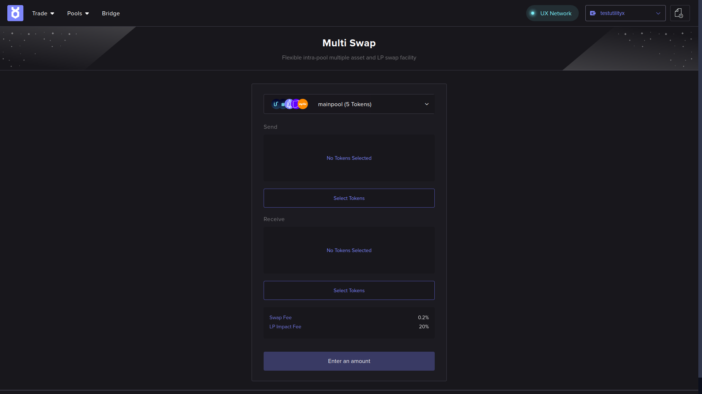
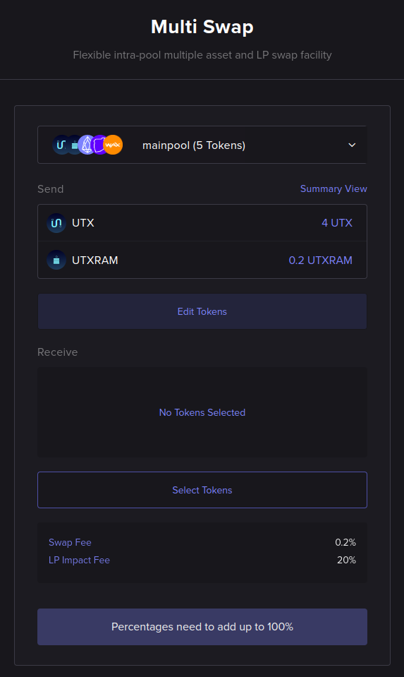

# Multi Swap

This section shows how to use the Multi Swap function.

Multi Swap allows us to sell multiple different tokens, and to buy multiple different tokens in return, all packaged in a single, simultaneous operation.

## Open the Multi Swap page

On the main menu bar at the top left of the page, hover your mouse over the **Trade** drop-down menu to expand it.

Then, click on the **AMM Multi Swap** option:

This should open the Multi Swap page:

## Select liquidity pool

At the top of the Multi Swap form, you will find the liquidity pool selection box.

A Multi Swap operation naturally only makes sense if it is submitted to a token liquidity pool that has more than a pair of tokens in it. If there are only two assets in a pool, then only simple swaps make sense in the context of that pool.

After you have selected a suitable multi-swap pool to use, it is time to select the tokens.

## Select tokens, amounts and percentages

You now have to select the tokens you want to _send_ to the pool (sell) and the tokens you want to _receive_ from the pool in return (buy). The tokens available for selection are, of course, the tokens supported by the multi-swap pool you have selected.

In this example, we will assume you have some liquid amount of both `UTX` and `UTXRAM` tokens, but you can use any token supported by the liquidity pool you have selected.

By default, no tokens are selected to be sent, as can be seen in the empty **Send** area of the form, and no tokens are selected to be received, as can be seen in the empty **Receive** area of the form:

Click on the **Select Tokens** button under the **Send** section of the form.

A pop-up window will appear, which will allow you to specify any amount of tokens to send (these will be token quantities that you already own, in your blockchain account). In this example, we will be sending `4 UTX` and `0.2 UTXRAM` tokens:

Click on **Continue** to close the window. The tokens and amounts you have selected to send will now be displayed on the main Multi-Swap form (see figure below). If you want to change this, you can click on the **Edit Tokens** button and repeat the token selection step.

The unclickable button at the bottom of the form is reminding us that _Percentages need to add up to 100%_. This refers to the token percentages we will set when we select the tokens to _receive_, which we will attend to next.

Click on the **Select Tokens** button under the **Receive** section of the form.

A pop-up window will appear, which will allow you to specify the _percentages_ of tokens to receive. In this example, we will be receiving our payout as 50% `EOS` tokens, 25% `WAX` tokens and 25% `TLOS` tokens:

Click on **Continue** to close the window. The tokens and ratios you have selected to receive will now be displayed on the main Multi-Swap form (see figure below). If you want to change this, you can click on the **Edit Tokens** button and repeat the token selection step.

## Review order summary

Before proceeding to executing the trade, you may want to see the summary of the proposed trade. To do that, click on any one of the **Summary View** links to the right-side of the form. Below, we can see the summary view of the example trade we are setting up:

Now that we are satisfied with the trade that we have set up, we will proceed to execute it.

## Execute multi-swap

When you are ready to perform the multi-swap, click on the **Submit** button at the bottom of the AMM Swap form.

A confirmation pop-up window will appear:

To execute the order, accept the Terms & Agreements and click **Execute**.

Approve the transaction on your Web3 (blockchain) wallet to proceed.

After you approve the transaction using your wallet, the **Execute** button will show a spinning progress indicator for a while, until the signed transaction is picked up by the blockchain.

## Await multi-swap completion

When the multi-swap is in progress, the following information box should pop up on the bottom-right of the screen:

Once the multi-swap is completed, you should see the following information box pop up:

That will mean the multi-swap is done, and we can now inspect the multi-swap report.

## Check multi-swap report

The procedure for checking the report is the same as described for the AMM Swap in the previous section: just click on the trade history icon at the top right of the page and locate your multi-swap transfer order. Here is the report from the multi-swap example:

We can see from the report that we have been subtracted `4 UTX` and `0.2 UTXRAM` from the user's blockchain account, but that `0.118 EOS`, `0.087 TLOS` and `0.2804 WAX` have been sent to the user's blockchain account.

Congratulations, you have successfully executed a multi-asset swap against a multi-swap token pool!
