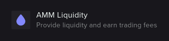
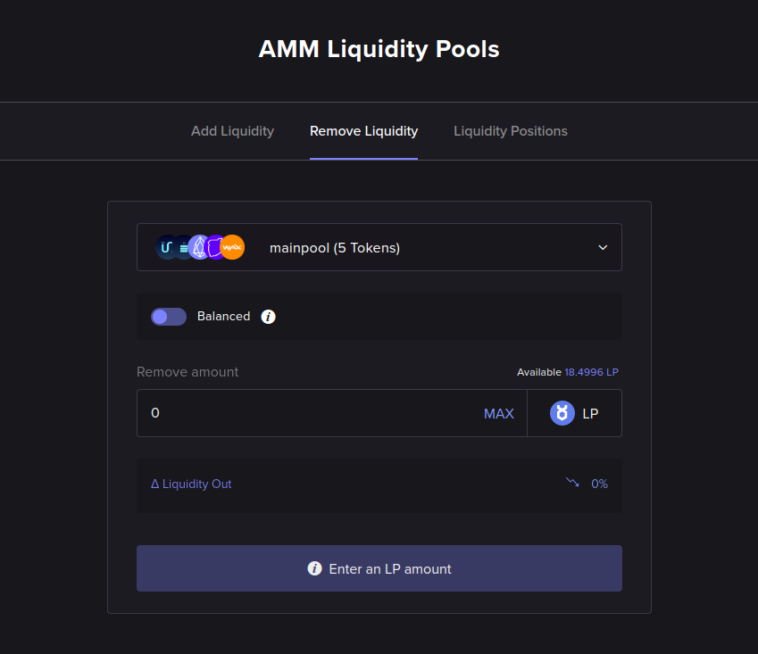

# Remove Liquidity

This section shows how to withdraw liquidity from UtilityX.

## Open the Remove Liquidity page

On the main menu bar at the top left of the page, hover your mouse over the **Trade** drop-down menu to expand it.

Then, click on the **AMM Liquidity** option:

Then, click on the **Remove Liquidity** tab in the AMM Liquidity page:

## Select pool

At the top of the Remove Liquidity form, you will select the AMM pool that you wish to remove liquidity from.

You must own a share of the selected pool, to be able to reduce that share. Note that each pool has its own liquidity provision share token, with its own symbol.

## Balanced vs. unbalanced

At the top of the Remove Liquidity form, you can toggle between the _balanced_ and _unbalanced_ liquidity removal modes.

In both modes, you need to specify the amount of liquidity provision share tokens you want to redeem (sell) to retrieve (buy) a quantity of the tokens that are in the pool.

The difference is that in balanced mode, you will be returned an equal share (in terms of trade value) of every token in the pool. In an unbalanced withdrawal from the pool, you can choose the percentages (ratios) of the tokens that you are going to be receiving.

## Remove liquidity

The example in the figure below is an unbalanced liquidity removal request that will forfeit `10 LP` shares of the `mainpool` pool, and get the pool withdrawal as `30% UTX`, `30% UTXRAM` and `40% EOS` (the other two tokens in the example pool, `TLOS` and `WAX`, are left with a percentage of zero).

If the balanced vs. unbalanced control is toggled to select the _balanced_ mode instead, the form will simply hide the token percentage selection box and assume an equal percentage distribution for all tokens (in the case of this example `mainpool`, that has five tokens, it will attribute a 20% ratio for all of them).

After completing the form and clicking on **Continue**, a confirmation dialog will be shown:

After the Terms & Conditions are accepted and the **Execute** button is clicked, the liquidity removal operation will be shown as pending:

When the liquidity removal auction is resolved, the operation will be shown as completed:

And finally, you will be able to see, in the order history report, exactly how many tokens were obtained by your liquidity withdrawal:

